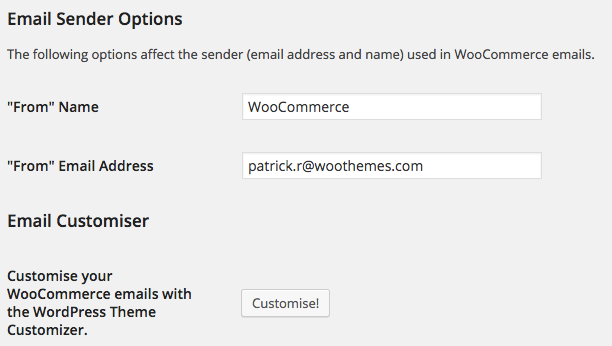

# Using the WordPress Customizer to Build Beautiful Plugin Settings Pages

### Patrick Rauland

### @BFTrick

---

^ What themes look like now-a-days

---


^ What plugin settings look like. This kind of sucks.

^ Let's look at this in a bit more detail

---


^ I guess I can figure out the background color. But what is the email background color? That takes a second to fill out.

^ What the hell is the base color? I have no idea.

^ I get the colors but what the hell are those numbers and letters on top of them?

^ Okay let's say I want to change a color for my email and I want to know what the base color looks like. Do I really have to send an email through WooCommerce?

---


^ You can actually preview the settings but they're this tincy link at the top.

^ First why isn't it a button? I want to generate a preview of my email. That's an action I want to press a button. I don't want to go to another webpage.

^ And of course why is it all the way at the top way above the colors? That makes no sense. It should be at the bottom after I've configured all of the settings.

---


^ This is a bit disappointing. We have to copy and paste an image url into a little box?

^ Aren't we past this? I'm not gonna lie I'm accustomed to GitHub where I just drag an image from my desktop onto an issue and watching it automatically upload. I don't give a crap what the URL of something is. I just want to drag and drop and image into the right place.

---


^ By the way if you actually upload something via the uploader this is what you see. There is no next step. People get stuck right here.

---



^ What plugin settings could look like

---

# Add a Customize Button

^ This customize button isn't really button. It's actually a link that points to the WordPress customizer with a few flags that let you modify exactly what the user sees.

^ One of the cool things you can do is load a specific page. So if you want to load a contact form you can do that. Or you could load the posts page. Or some other special page in your blog.


---

```php
// get theme customizer url
$url = admin_url() . 'customize.php';
```

^ First we need to get the url of the customizer. If a user clicks on this link it would load the regular WordPress customizer. Nothing special would happen.

---

```php
// get special page
$shop_page_url = get_permalink( wc_get_page_id( 'shop' ) );

// if we have a shop page go straight to it - else go to the home page
if ( $shop_page_url ) {
	$url .= urlencode( $shop_page_url );
} else {
	$url .= urlencode( site_url() );
}

// save the url
$this->theme_customizer_url = $url;
```

^ Now we need to get the special page. In this example I'm loading the shop page in WooCommerce. This would be really useful if you wanted to let the user choose how many columns they have or how many products show up on the shop page.

---

```php
// get special page
$shop_page_url = get_permalink( wc_get_page_id( 'shop' ) );

// if we have a shop page go straight to it - else go to the home page
if ( $shop_page_url ) {
	$url .= urlencode( $shop_page_url );
} else {
	$url .= urlencode( site_url() );
}

// save the url
$this->theme_customizer_url = $url;
```

^ Now we need to get the special page. In this example I'm loading the shop page in WooCommerce. This would be really useful if you wanted to let the user choose how many columns they have or how many products show up on the shop page.

---

```php
array(
	'title' => __( 'Customise!', 'woocommerce' ),
	'desc'  => __( 'Customise your product archive
	pages with the WordPress Customizer.', 'woocommerce' ),
	'type'  => 'wc_button',
	'link'  => $this->theme_customizer_url
)
```

WooCommerce Settings API: http://docs.woothemes.com/document/settings-api/

^ This is the WooCommerce code you need to add a button to your settings page. There's more here. You have to add this array

---


^ Let's recap. This is what we've done. Instead of loading the front page of the blog we've loaded the shop page in WooCommerce.

---

# Add Return URL to Customizer URL

---

```php
// get the return page
$url .= '&return=' . urlencode( admin_url() .
'admin.php?page=wc-settings&
tab=products&section=display' );
```

^ Put your original settings page right after the admin_url(). And then of course encode it.

---


^ So if the user leaves the customizer they'll return to the settings page they came from.

---


---

Add flag to customizer page

---

Remove default controls from the customizer
