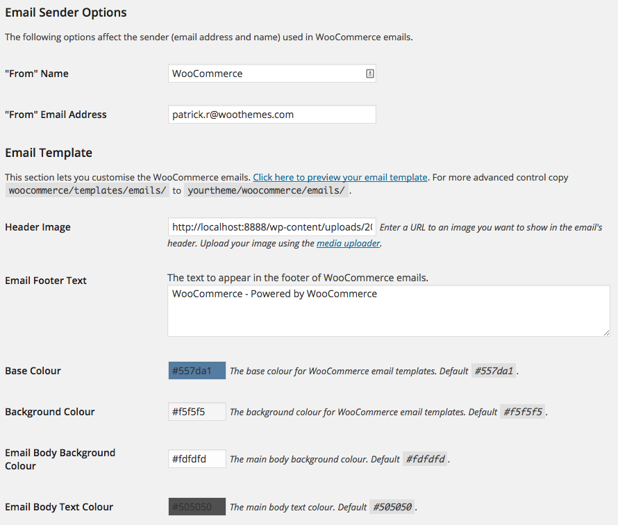
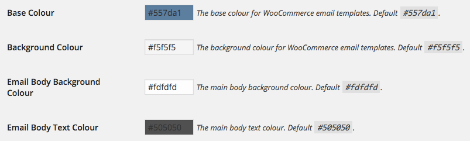
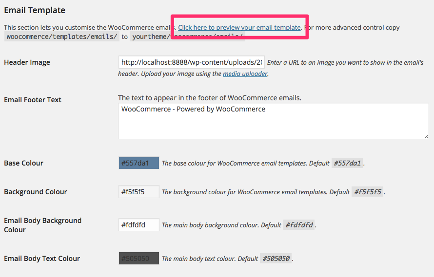
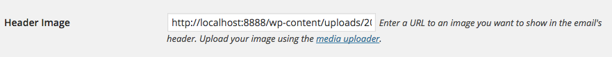
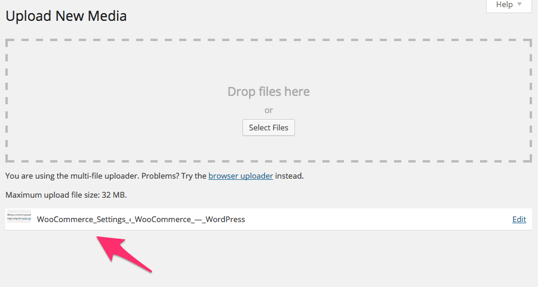
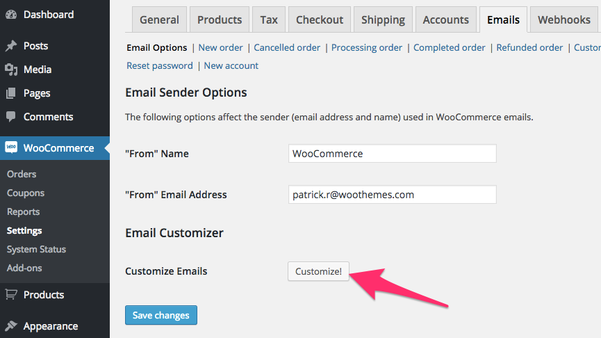
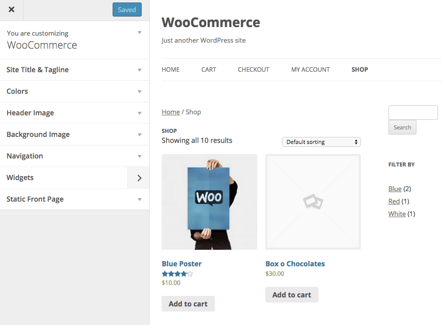
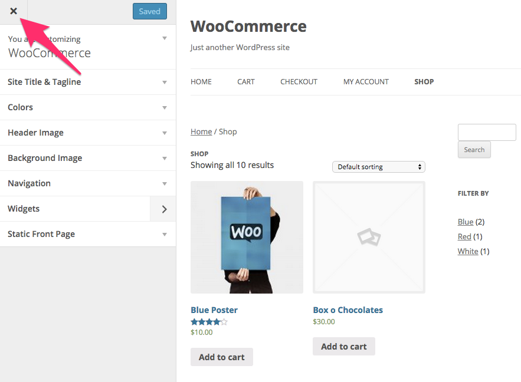
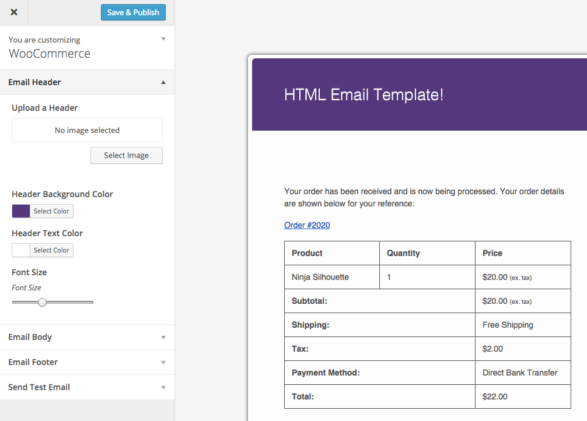
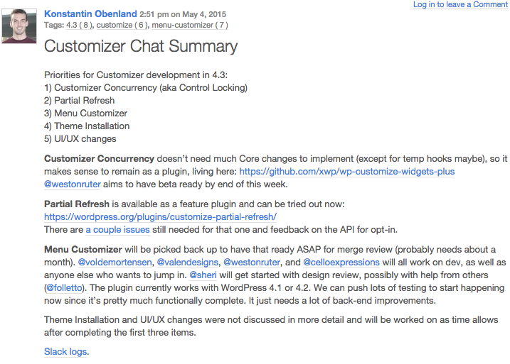

# Using the WordPress Customizer to Build Beautiful Plugin Settings Pages

### Patrick Rauland

### @BFTrick

^ Hey everyone my name is Patrick and I do a lot of the behind the scenes planning for WooCommerce. To do my job I have to perform one of the most horrifying tasks in all of web. It's not migrating databases and it's not maintaining backwards compatibility - although both of those are incredibly challenging. It's watching a user attempt to use your software.

^ I learned two important things watching users.

---


^ It's unbelievable how many ways users can break your software.

^ This here is a video of a friend of mine who used to be a web developer trying to install a plugin. It takes him 9 minutes to install the plugin.

^ Everything that you never imagined goes wrong here.

^ The plugin won't install through the WordPress dashboard. A regular FTP program won't work either. He tries to upload the plugin through his host's FTP program. Unfortunately he can't remember his password and he doesn't use a password manager.

^ At one point he says, "Ugh WooCommerce!", because it won't activate. And the reason it won't activate is because he didn't wait for the plugin to finish uploading. It was only 1/2 of the way uploaded.

^ In this user's mind he already dislikes WooCommerce even though not a single like of code has run.

^ The first thing I learned about users is that they may be in a terrible mood before they attempt to use your software. They may be having hosting problems, ftp problems, plugin conflicts, cash flow problems. As a software developer I usually say "oh if they to do X they'll just google it and figure it out". And that isn't the case. They're too busy and they have to run their business. Not figure out your plugin's settings screen.

---


# Reading Can Be Difficult

^ A little while ago I wrote a book all about WooCommerce. This is how you install it, this is how you add a product, this is how you configure Stripe, that type of stuff.

^ I spent a lot of time polishing this and was really proud when it launched. So a few weeks ago when I got an email titled "Mistake In Your Book" I felt a lot of anxiety.

^ I open up the email and he goes into detail - you know 3 or 4 bullet points - about how he tried to follow my instructions to install a theme. He downloaded the theme to his computer, and then instead of uploading via the themes page he tried to upload via the plugins page. And of course not surprisingly he got an error.

^ "My god" I'm thinking at this point. I wrote a tutorial on how to install a theme and I tell them to use the plugin installer?

^ I open up the exact page that had the instructions and the title of the chapter is "how to install a plugin". Basically he was reading the wrong instructions.

^ This guy spent *15 minutes* reading the document,  finding my website, goinging to my contact form, and writing a detailed email about everything I did wrong. All the while he wouldn't spend 1 minute to reread the original document.

^ As silly as this situation was I actually got something really useful from it. And this is the second thing I learned about users and the focus of this topic today.

---

> No matter how clearly you write people will misinterpret your words.

^ What this means for plugin developers is that every single bit of text you have in your plugin will need to be explained in detail. And no matter how clearly you describe something someone will write in and ask you what it means.

^ That leaves us with two choices pay a team of people to answer all of these pre-sale questions or make something better than just words. That's what I'm going to talk about today.

---



^ What plugin settings look like. This kind of sucks.

^ Let's look at this in a bit more detail

---



^ I guess I can figure out the background color. But what is the email background color? That takes a second to fill out.

^ What the hell is the base color? I have no idea.

^ I get the colors but what the hell are those numbers and letters on top of them?

^ Okay let's say I want to change a color for my email and I want to know what the base color looks like. Do I really have to send an email through WooCommerce?

---



^ You can actually preview the settings but they're this tincy link at the top.

^ First why isn't it a button? I want to generate a preview of my email. That's an action I want to press a button. I don't want to go to another webpage.

^ And of course why is it all the way at the top way above the colors? That makes no sense. It should be at the bottom after I've configured all of the settings.

---



^ This is a bit disappointing. We have to copy and paste an image url into a little box?

^ Aren't we past this? I'm not gonna lie I'm accustomed to GitHub where I just drag an image from my desktop onto an issue and watching it automatically upload. I don't give a crap what the URL of something is. I just want to drag and drop and image into the right place.

---



^ By the way if you actually upload something via the uploader this is what you see. There is no next step. People get stuck right here.

---


^ What plugin settings could look like

---

# 7 Steps to Hijack the Customizer

---

# 1. Create a Button That Loads the Customizer

^ This customize button isn't really button. It's actually a link that points to the WordPress customizer with a few flags that let you modify exactly what the user sees.

---

```php
// get customizer url
$url = admin_url( 'customize.php' );
```

^ First we need to get the url of the customizer. If a user clicks on this link it would load the regular WordPress customizer. Nothing special would happen.

---

```php
array(
	'title' => __( 'Customize!', 'woocommerce' ),
	'desc'  => __( 'Customize your product archive
	pages with the WordPress Customizer.', 'woocommerce' ),
	'type'  => 'wc_button',
	'link'  => $url
)
```

WooCommerce Settings API: http://docs.woothemes.com/document/settings-api/

^ This is the WooCommerce code you need to add a button to your settings page. There's more here. You have to add this array

---



---

# 2. Load a Specific Page

---

```php
// get special page
$shop_page_url = get_permalink( wc_get_page_id( 'shop' ) );

// if we have a shop page go straight to it
// the default will load the home page
if ( $shop_page_url ) {
	$url = add_query_arg(
		'url',
		urlencode( $shop_page_url ),
		$url );
}
```

^ Now we need to get the special page. In this example I'm loading the shop page in WooCommerce. This would be really useful if you wanted to let the user choose how many columns they have or how many products show up on the shop page.

---



^ Let's recap. This is what we've done. Instead of loading the front page of the blog we've loaded the shop page in WooCommerce.

---

# 3. Add a Return URL

---

```php
// get the return page
$url = add_query_arg(
	'return',
	urlencode(
		add_query_arg(
			array(
				'page' => 'wc-settings',
				'tab' => 'email'
			),
			admin_url( 'admin.php' )
		)
	),
	$url
);
```

^ Put your original settings page right after the admin_url(). And then of course encode it.

---



^ So if the user leaves the customizer they'll return to the settings page they came from.

---

# 4. Add a Flag in Customizer URL

---

```php
$url = add_query_arg(
	'wc-email-customizer',
	'true',
	$url
);
```

^ This is what we need to differentiate our customizer from another customizer.

^ TODO - I believe this is what the customizer intends to do with the `context` arguement for settings

---

# 5. Hide Default Controls

---

```php
add_filter( 'customize_control_active', 'control_filter', 10, 2 );

function control_filter( $active, $control ) {
	if ( in_array(
		$control->section,
		array(
			'wc_email_header',
			'wc_email_body',
			'wc_email_footer',
			'wc_email_send'
		)
		)
	) {
		return true;
	}

	return false;
}
```

^ this `customize_control_active` is a really awesome filter. We can use this filter to see if the control is in a certain section and if it's not then disable it.

---

```php
global $wp_customize;
$wp_customize->remove_section( 'themes' );
```

^ In WordPress 4.2 there's a new themes section which doesn't get hidden by the filter above. You have to manually remove the theme's section.

---


---

# 6. Add New controls

---

```php
$wp_customize->add_control(
	new WP_Customize_Image_Control(
		$wp_customize,
		'wc_email_header_image_control',
		array(
			'label'      => __( 'Upload a Header', 'woocommerce' ),
			'priority'   => 10,
			'section'    => 'wc_email_header',
			'settings'   => 'woocommerce_email_header_image',
		)
	)
);
```

^ You obviously need to have your sections and settings setup

---

```php
// autofocus a section
$url = add_query_arg(
	'autofocus[section]',
	'{name of your section}',
	$url
);
```

^ Just to make the UI a bit nicer you can auto focus the first section.

---



---

# 7. Save Settings as Plugin Options

---

```php
$wp_customize->add_setting( 'wc_email_background_color',
	array(
		'type'      => 'option',
		'default'   => '#f5f5f5',
		'transport' => 'postMessage',
	)
);
```

^ This is the standard way to save a setting. What you want to pay attention to is the *type* setting. *Type* can be 'option' or 'theme_mod' (defaults to 'theme_mod')

^ Obviously you want to do this unless you want your plugin settings to be theme specific

^ This is step 7 out of 7. In terms of code this isn't very tricky. You have to spend a couple hours digging in and you'll get it.

^ This doesn't mean there aren't any hurdles to jump

---



^ The first hurdle customizer is under rapid development. If you plan on building on top of it you should follow all of the changes going into it.

^ The second hurdle is that you'll have to play close attention to priorities and when certain hooks are being fired. Normally you can hook everything into admin_init but there were a few things that needed to be fired before or after that. If something's not working it's probably at the wrong priority.

^ By now I hope that I've conveyed a few things...

---

> No matter how clearly you write people will misinterpret your words

---

> Using the Customizer allows you to *show* users what a setting does

^ There are no questions about the email base color

^ There are no questions about what does this look like in an email browser?

^ There are no questions about how a particular image will look in the header.

^ Everything is right there infront of the user

^ And if a user had to spend 9 minutes installing a plugin because WordPress can be complex then when they finally get to your settings page to install the plugin it's as easy as point and click.

---

# Patrick Rauland
## @BFTrick
### WooCommerce Product Manager
### WooThemes

^ If you have any questions I'll be in the hallway for the next 30 minutes
